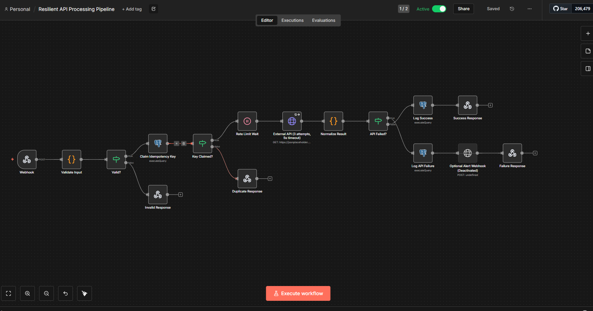
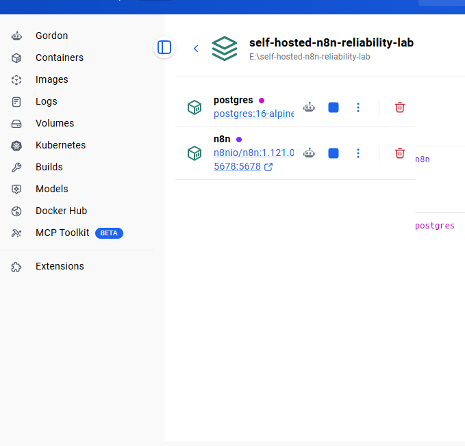
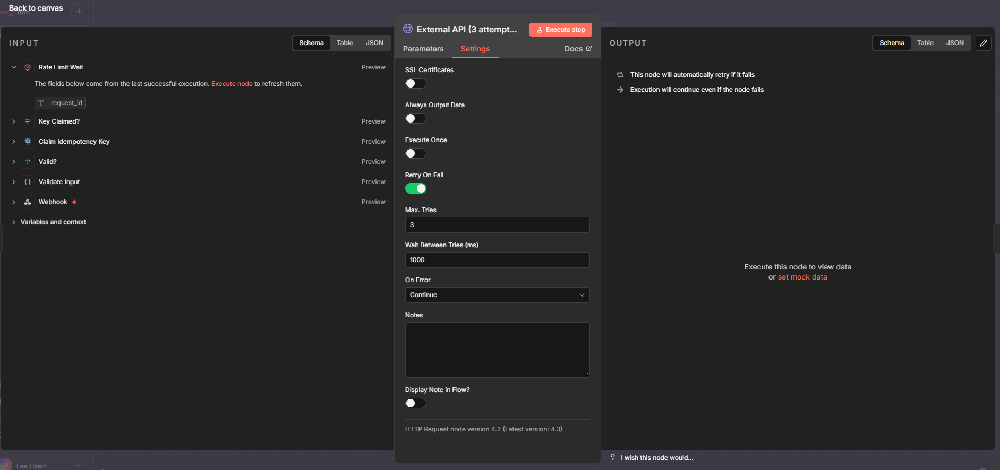
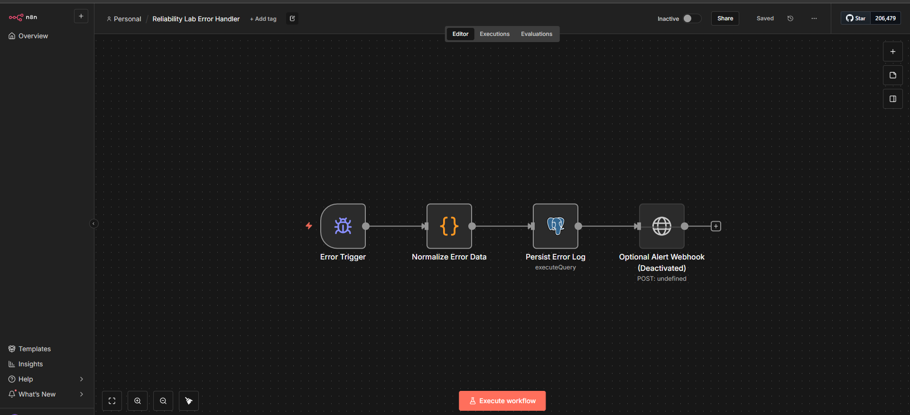
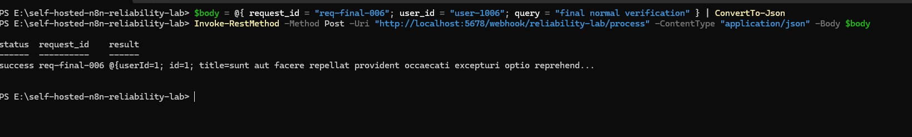
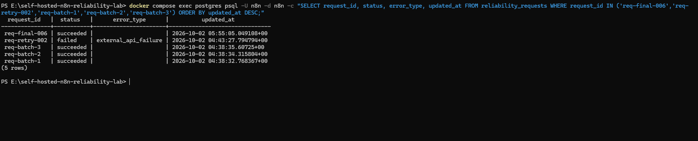
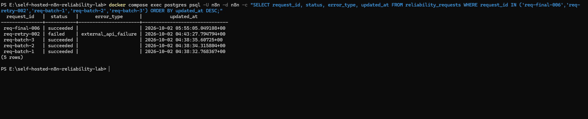

# Self-Hosted n8n Reliability Lab

A local reliability portfolio project built with n8n 1.121.0, Docker Compose, and PostgreSQL. It processes webhook requests with validation, PostgreSQL-backed idempotency, bounded retries, request throttling, and structured success and failure logging.

## Project Overview

The main workflow accepts a JSON request, validates required fields, atomically claims its `request_id`, calls a public REST API, and returns a normalized result. Duplicate requests are short-circuited. Transport failures return HTTP 502 after retry handling. A separate Error Workflow captures unexpected workflow failures and writes them to PostgreSQL.

This project demonstrates a self-hosted n8n reliability exercise in a local environment. It is not a production deployment or a claim of production SRE experience.

## Architecture

```text
Client
  ↓ POST /webhook/reliability-lab/process
Webhook → Validate → PostgreSQL idempotency claim
                         ├─ invalid → HTTP 400
                         ├─ duplicate → duplicate response
                         └─ new request → per-request Wait → external API
                              → retry on transport failure (3 tries)
                              → normalize → PostgreSQL result log → response

Unexpected main workflow failure
  → Error Workflow → normalize error → reliability_errors log
```

See [docs/architecture.md](docs/architecture.md) for the component outline.

## Reliability Features

- **Self-hosting:** n8n and PostgreSQL run as Docker Compose services with named volumes and restart policies.
- **Validation:** Missing required input returns HTTP 400 before the idempotency claim and API request.
- **Deduplication and idempotency:** `request_id` is the idempotency key. PostgreSQL's primary key and `INSERT ... ON CONFLICT DO NOTHING` provide an atomic claim before the external API step.
- **Retry and timeout:** The external HTTP Request node is configured for three attempts, a 1,000 ms retry delay, and a 5,000 ms timeout. Transport errors are normalized as failures rather than interpreted as successful responses.
- **Request throttling:** A Wait node adds a per-request delay. The verified test covered three requests; this is not a global concurrency limiter.
- **Failure handling:** Validation errors return HTTP 400, duplicate IDs take a duplicate branch, external transport failures return HTTP 502, and unexpected workflow errors invoke a separate Error Workflow.
- **Logging:** Successful and failed requests are recorded in PostgreSQL. Unexpected workflow errors are stored in `reliability_errors`.

## Tech Stack

n8n 1.121.0, Docker Compose, PostgreSQL, REST API, webhooks, JSON, and JavaScript Code nodes.

## Setup

1. Install Docker Desktop with Docker Compose available in PowerShell.
2. Copy `.env.example` to `.env` and replace the database password and n8n encryption key placeholders with local random secrets. The `.env` file is ignored by Git.
3. Start the services:

   ```powershell
   Copy-Item .env.example .env
   docker compose up -d
   ```

   On a fresh PostgreSQL volume, the official PostgreSQL image runs `db/init.sql` automatically during first-time database initialization. It creates both reliability tables before n8n uses them. PostgreSQL init scripts run only when the data directory is initialized; starting Compose with an existing `postgres_data` volume does not rerun them.

4. Open [http://localhost:5678](http://localhost:5678) and finish the local n8n owner setup if needed.
5. Create a PostgreSQL credential in n8n using host `postgres`, port `5432`, and the database/user/password from `.env`; select it on the Postgres nodes.
6. Import the two current workflow JSON files in `workflows/`, set the main workflow's Error Workflow to `Reliability Lab Error Handler`, and activate the main workflow.
7. To configure the optional alert endpoint, set `ALERT_WEBHOOK_URL` in `.env` and recreate the n8n container with `docker compose up -d`. The alert nodes are disabled by default and must be enabled in n8n to send alerts. The outbound alert was not runtime-verified.

The workflow JSON files in `workflows/` are the current validated exports from the n8n 1.121.0 instance and include the runtime transport-error handling correction. Credential secrets remain in n8n and `.env`, never in exported JSON or Git.

## Runtime Verification

The following behavior was exercised against the local Docker Compose stack running n8n 1.121.0 with PostgreSQL:

- Production Webhook processed a valid request.
- Invalid input returned HTTP 400.
- Repeated `request_id` was handled by the duplicate/idempotency branch.
- Successful request results were written to PostgreSQL.
- External API transport failure returned HTTP 502 after the configured retries; the retry test took approximately 5.24 seconds.
- Three throttled requests completed in approximately 4.08 seconds and were recorded in PostgreSQL.
- A forced main-workflow failure invoked the separate Error Workflow. The error execution completed with `mode: error` and `status: success`, and the failure was written to `reliability_errors`.
- The temporary forced-error condition was removed, and final request `req-final-002` completed successfully.

See [docs/test-scenarios.md](docs/test-scenarios.md) for the test matrix and scope. The optional outbound alert webhook was not part of the verified results.

## Screenshots / Evidence

### Workflow and deployment


*Main workflow canvas with validation, request claim, API processing, and response paths.*


*Docker Desktop view of the n8n and PostgreSQL services.*


*Retry On Fail is enabled with Max. Tries 3 and a 1,000 ms interval.*


*Error Trigger, error normalization, PostgreSQL logging, and the disabled optional alert node.*

### Runtime evidence


*Production Webhook response showing a successful request.*


*PostgreSQL query output with successful and failed request records.*


*Terminal capture associated with the error-log check; no query output is visible in this image.*

## Troubleshooting

### Transport error was treated as success

An HTTP transport failure can return no `statusCode`. The initial Normalize Result logic used a success default when that field was absent, which incorrectly classified the failed request. The normalization logic was corrected to recognize transport-error output as failure, route it through the external API failure branch, record the failure, and return HTTP 502. The corrected behavior was confirmed with the transport-failure test.

### Retry setting was disabled

The first failure test exposed that **Retry On Fail was OFF** in the actual HTTP Request node. It was enabled and configured for a maximum of three attempts with a 1,000 ms interval. The subsequent transport-failure test took approximately 5.24 seconds and returned HTTP 502 after retry handling.

### Error Workflow database logging

The Error Handler's PostgreSQL logging path initially had table/query issues. The table creation and insert query were corrected for the error record fields. A forced main-workflow error then invoked the Error Workflow successfully and created a `reliability_errors` record. The temporary test failure was removed afterward.

## Repository Contents

- `docker-compose.yml` — local n8n 1.121.0 and PostgreSQL services.
- `db/init.sql` — application table initialization for a fresh PostgreSQL data volume.
- `.env.example` — local configuration placeholders only.
- `workflows/` — current validated workflow JSON exports.
- `sample-data/` — valid, duplicate, and invalid webhook payload examples.
- `docs/` — architecture, verification scenarios, and screenshot guidance.

## CV-Safe Summary

Built and exercised a local self-hosted n8n 1.121.0 and PostgreSQL workflow using Docker Compose.
Implemented and verified request validation, PostgreSQL-backed idempotency, retry handling, throttling, HTTP failure responses, and structured logging.
Verified an Error Workflow run and PostgreSQL error logging; this was a local portfolio lab, not a production deployment.
